# Speprove Frontend

## Introduction

Speprove Frontend is the React/Next.js-based web application for the Speprove IELTS Speaking platform. Built with **Next.js 16 (App Router)**, **React 19**, and **TypeScript**, it delivers a highly interactive, responsive, and premium user experience for IELTS speaking practice, mock exams, AI assessment tracking, and payment processing.

The frontend is specifically designed with rich, interactive tools to simulate real testing conditions and visualize detailed speech analysis generated by AI evaluation pipelines.

---

## User Interface Preview

### Speaking Practice Workspace

|                Speaking Practice Workspace                 |                  Vocabulary & Leaderboard                   |
| :--------------------------------------------------------: | :---------------------------------------------------------: |
|       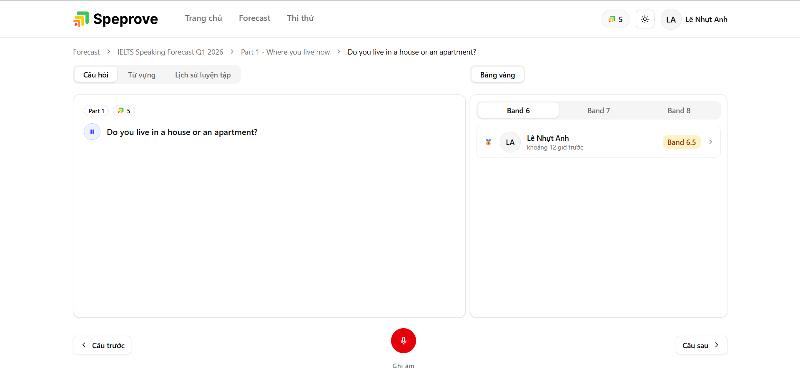        | 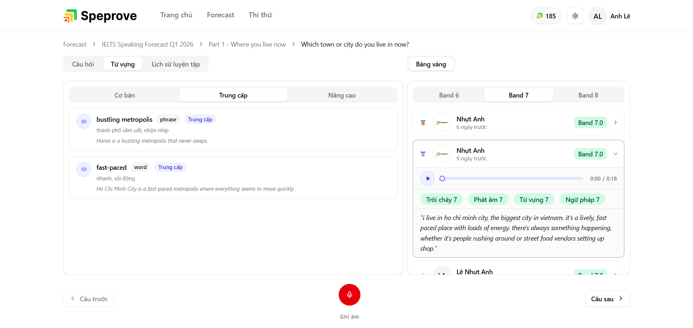 |
|                **Pronunciation Evaluation**                |                   **Fluency Evaluation**                    |
| 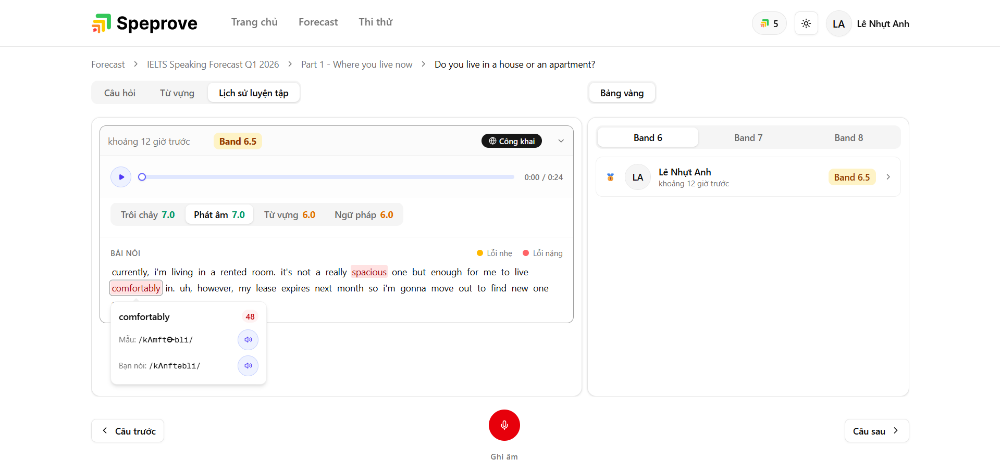 |       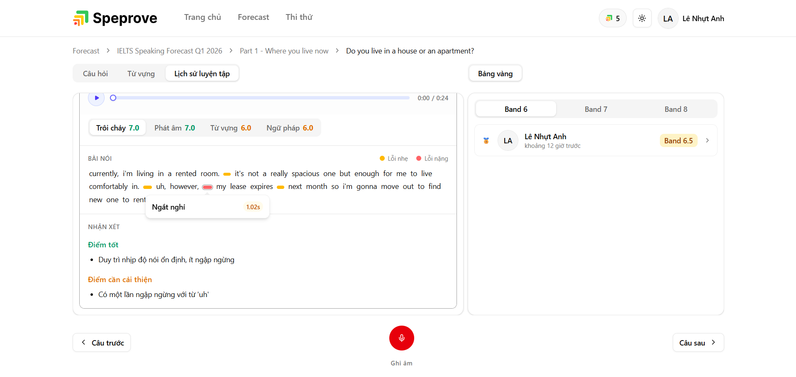        |
|                   **Grammar Evaluation**                   |                   **Lexical Evaluation**                    |
|       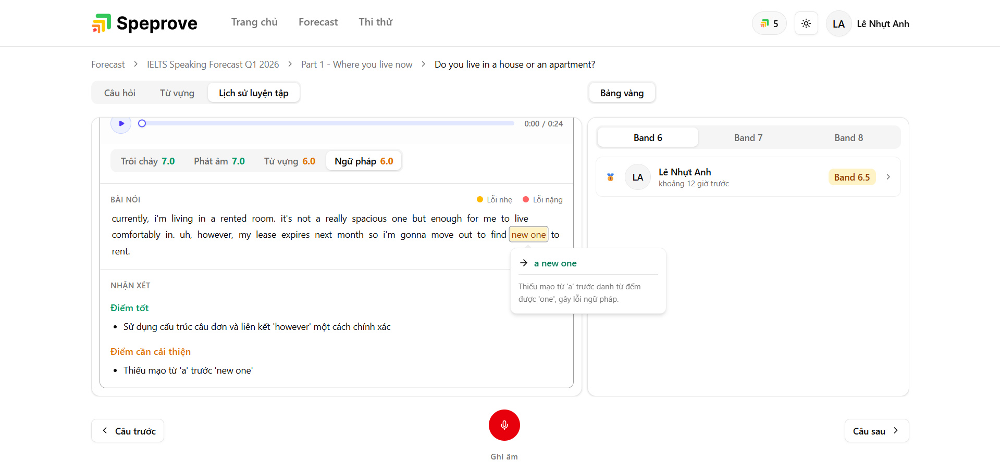       |       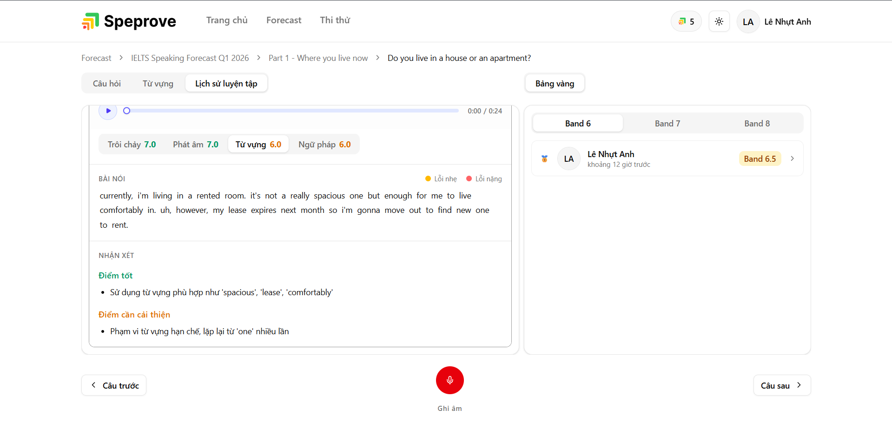        |

### Mock Test Simulator

|                      Mic Check                      |                   Listening Phase                   |
| :-------------------------------------------------: | :-------------------------------------------------: |
| 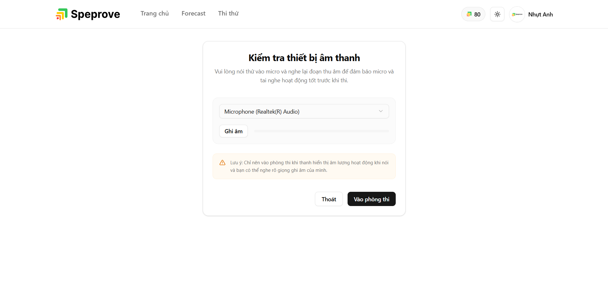 | 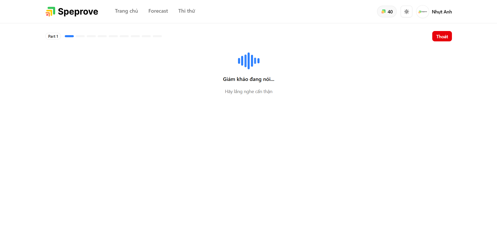 |
|                 **Answering Phase**                 |            **Part 2 Cue Card Planning**             |
| 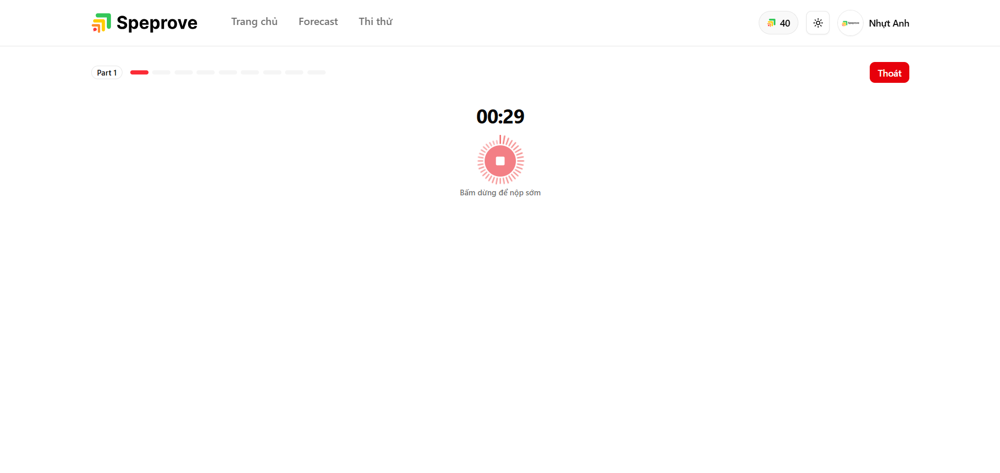  |    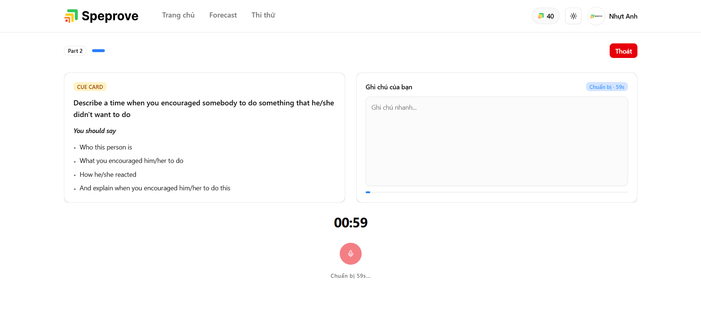     |
|                **Mock Test Result**                 |                                                     |
|    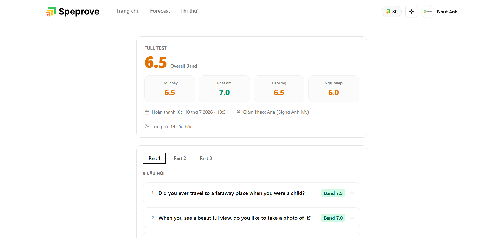    |                                                     |

---

## Features

### Forecast Discovery & Browsing

- **IELTS Forecast Navigation**: Browse curated forecast collections, speaking topics, and structured question banks.
- **Categorized Question Index**: Filter questions by Part (Part 1, 2, or 3) and topic categories with practiced/unpracticed status tracking.
- **Breadcrumb Pathways**: Dynamic breadcrumb links connecting forecast lists, topic detail pages, and practice screens.

### Speaking Practice Workspace

- **Responsive Workspace**: Desktop split-screen view (Left: question & recorder; Right: community leaderboard) auto-collapsing into a unified tab-bar on mobile.
- **In-Browser Recording**: High-quality audio recording leveraging `RecordRTC` with a live audio visualizer and audio state controls.
- **Community Leaderboard**: Access high-scoring public attempts by other users for the same question, with a built-in player for peer learning.
- **Level-Based Vocabulary Suggestions**: Dynamic list of Basic, Intermediate, and Advanced words with parts of speech, definitions, native audio playbacks, and example sentences.

### Mock Test Simulator

- **Flexible Test Options**: Choose to practice individual sections (Part 1, Part 2, or Part 3) or take a full-length simulated interview.
- **Pre-Test Mic Checker**: Interactive mic testing panel with a live `wave-bars` volume visualizer to test device capture and permissions before starting.
- **Part 2 Cue Card Workspace**: Planning screen featuring a 1-minute prep countdown timer, cue card bullet points, and an active notepad scratchpad.
- **Session State Recovery**: Caches active state variables to prevent progress loss, allowing users to seamlessly resume their active mock test session on reload or network drops.

### AI-Powered Evaluation & Feedback

_Unified review interface for both practice attempts and mock test responses, breaking down the 4 core IELTS criteria:_

- **Pronunciation (P)**: Word-by-word correctness color-coding. Clicking a word opens an interactive popover showing its IPA transcription, spelling correctness, and dedicated audio playback.
- **Grammar (GRA) & Vocabulary (LR)**: Highlighted phrase errors in the transcript with popups for error descriptions and corrections.
- **Fluency (FC)**: Inline pause markers displaying silence durations directly within the transcript text.
- **Strengths & Areas for Improvement**: Lists of Strengths and Limitations for all non-pronunciation criteria.

### Account & Personalization

- **Profile Customization**: Edit display name, check current credit balance, and upload avatars with a live preview.
- **Password Administration**: Change passwords or set new credentials (for Google OAuth single sign-on users).
- **Examiner Voice Configurator**: Settings panel to choose the Examiner's voice by accent/locale and gender (Male/Female), with built-in voice preview playbacks.
- **Mock Test Logs & History**: Displays all speaking mock test sessions created (in-progress, completed, processing, failed, refunded), allowing candidates to **resume** incomplete tests or **retry** evaluation requests for failed attempts.

### Payments & Credits

- **PayOS Checkout**: Dynamic QR code generation with status polling for package checkouts.
- **Credit Audits**: Transactional history tab showing balance updates, package charges, or refunds.

### User Experience & Design

- **Responsive Layout**: Mobile-first design conforming to standard Tailwind CSS breakpoints ensuring all settings panels, practice screens, and results adapt gracefully from mobile to desktop.
- **Automatic Dark/Light Mode**: Full CSS-variables styling system supporting dark/light UI transitions synchronized with system preferences.

---

## Tech Stack

| Category                    | Technology                                                   |
| :-------------------------- | :----------------------------------------------------------- |
| **Framework**               | Next.js 16 (App Router), React 19                            |
| **Language**                | TypeScript 5                                                 |
| **Data Fetching**           | TanStack React Query 5, Native Fetch API                     |
| **State Management**        | Zustand 5                                                    |
| **Styling & UI Components** | Tailwind CSS v4, shadcn/ui, Framer Motion & `tw-animate-css` |
| **Forms & Validation**      | React Hook Form, Zod 4                                       |
| **Audio Processing**        | RecordRTC, Custom Web Audio Player APIs                      |
| **Realtime**                | Socket.io Client                                             |
| **Package Manager**         | `pnpm` 10                                                    |

---

## Architecture

### Data Flow Pattern

```
api-config.ts ──> *.api-request.ts ──> *.query.ts ──> Component
```

- **API Endpoints**: Defined statically in `src/constants/api-config.ts`.
- **Request Wrappers**: Modular request functions in `src/api-requests/<domain>.api-request.ts` using the customized `http` utility.
- **React Query Hooks**: Encapsulated into queries/mutations in `src/queries/<domain>.query.ts`.
- **Components**: Consume these custom query hooks, maintaining clean separation of concerns.

### State Management

- **Server State**: Managed via **TanStack React Query** for automatic caching, revalidation, and state synchronization.
- **Client State**: Global UI/app state managed via **Zustand** stores (`auth`, `app-loading`, `app-preference`).

### HTTP Layer

Centralized Native Fetch wrapper (`src/utils/http.util.ts`) with:

- **Automatic Credentials**: Automatic session credentials sharing (`credentials: 'include'`).
- **Token Refresh Queue**: Intercepts 401 errors to refresh access tokens, using promise caching to avoid parallel refresh race conditions.
- **Form Data Support**: Automated header handling when uploading assets or recording files via `FormData`.
- **Path Parameter Substitution**: Dynamically replaces placeholders (e.g., `:id`) in endpoint URLs with actual values.

### Route Protection

Guarded by `src/proxy.ts` (Next.js middleware adapter):

- **Protected Paths**: `/account/*`, `/payment/*` (redirects unauthorized users to `/login`).
- **Auth Paths**: `/login`, `/register`, `/forgot-password`, `/verify-otp`, `/reset-password` (redirects logged-in users back to the homepage `/`).

---

## Getting Started

### Prerequisites

- Node.js 20+
- pnpm 10+

### Installation

Install project dependencies using `pnpm`:

```bash
pnpm install
```

### Environment Setup

Copy `.env.example` to `.env` and configure:

```bash
cp .env.example .env
```

Ensure all required environment variables are filled in.
_Note: Environment variables are validated on startup via Zod in `src/envConfig.ts`._

### Development

Start the local development server with Turbopack enabled:

```bash
pnpm dev
```

Open [http://localhost:3000](http://localhost:3000) in your browser.

### Production

Build the optimized application bundle and start the server:

```bash
pnpm build
pnpm start
```

### Docker

To run the containerized frontend:

```bash
# Build the Docker image
docker build -t speprove-fe .

# Run the container
docker run -p 3000:3000 --env-file .env speprove-fe
```

---

## Scripts

| Command           | Description                                                    |
| :---------------- | :------------------------------------------------------------- |
| `pnpm dev`        | Start development server using Next.js Turbopack at port 3000. |
| `pnpm build`      | Compile the production-ready standalone build output.          |
| `pnpm start`      | Run the compiled production build locally.                     |
| `pnpm lint`       | Analyze source files for ESLint errors.                        |
| `pnpm format`     | Auto-format codebase using Prettier.                           |
| `pnpm type-check` | Perform strict TypeScript type checking (`tsc --noEmit`).      |

---

## Project Structure

```bash
src/
├── api-requests/          # Domain-based API request wrappers
├── app/                   # Next.js App Router root
│   └── [locale]/          # Route-level internationalization wrapper
│       ├── (auth)/        # Auth group routes (login, register, OTP)
│       ├── (home)/        # Main dashboard and homepage layout
│       ├── account/       # User profile details and settings tabs
│       ├── forecast/      # Forecast lists and topic question pages
│       ├── mock-test/     # Part-based and Full IELTS Mock testing
│       └── payment/       # Premium packages & checkout logs
├── assets/                # Static local media imports and styles
├── components/            # Reusable UI & Layout code
│   ├── form/              # Standardized validation form field controls
│   ├── layout/            # Layout systems (Container wrapper)
│   └── ui/                # Base Shadcn/Radix components (Button, Dialog, AudioPlayer)
├── constants/             # API routing names, local storage keys, configurations
├── hooks/                 # Custom shared React Hooks (countdown, recorders, parameters)
├── i18n/                  # Localization settings and routing configurations
├── lib/                   # Preconfigured utilities (cn helper, tailwind utilities)
├── logger/                # Application-level logs configuration
├── messages/              # Translation localization dictionaries (en.json, vi.json)
├── queries/               # React Query queries & mutations hooks definitions
├── routes/                # Client route configuration dictionary
├── store/                 # Global Zustand state management stores
├── types/                 # Application TypeScript type definitions
├── utils/                 # Static helpers (HTTP client, audio processing utility wrappers)
├── validations/           # Zod validation schemas for forms and state checks
├── envConfig.ts           # Zod-validated environment configurations loader
└── proxy.ts               # Custom locale-aware authentication route-guard middleware
```
